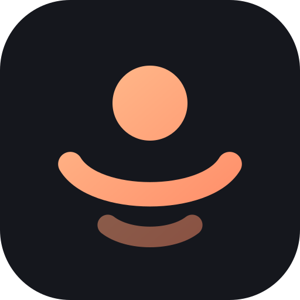
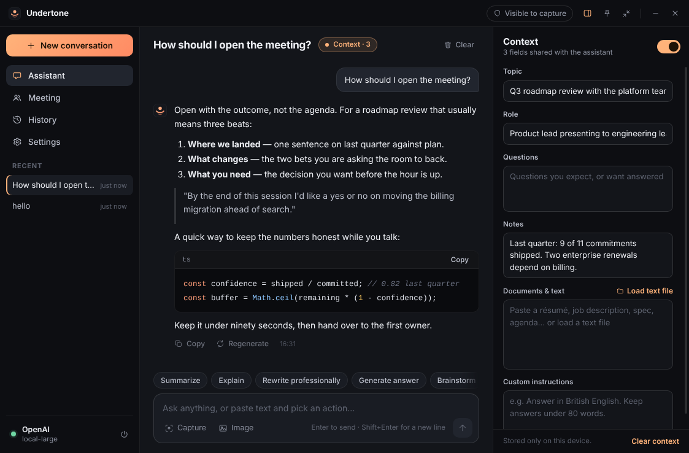
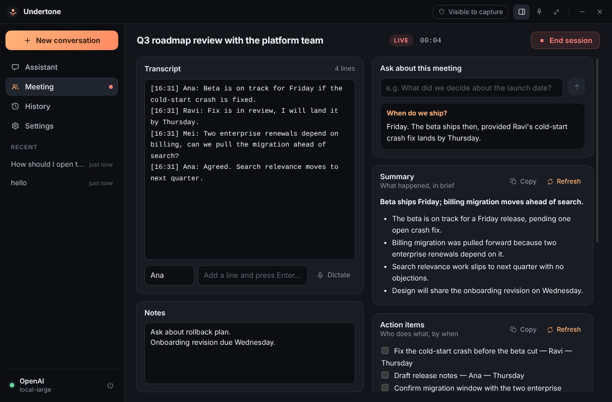
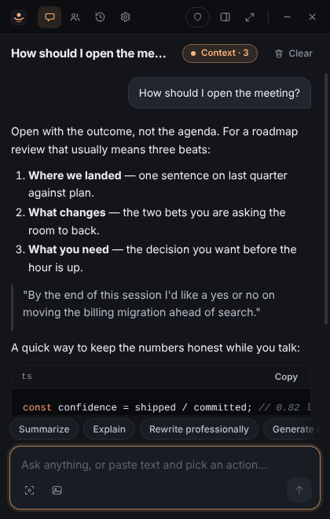
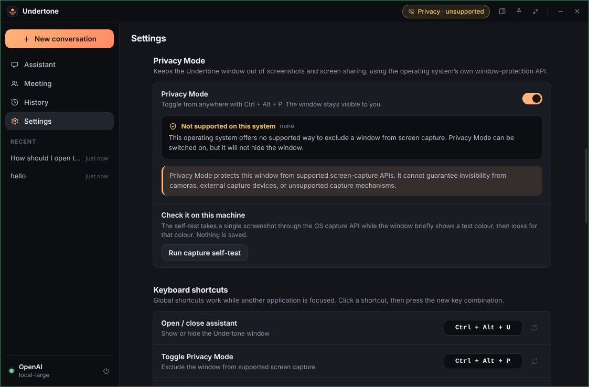
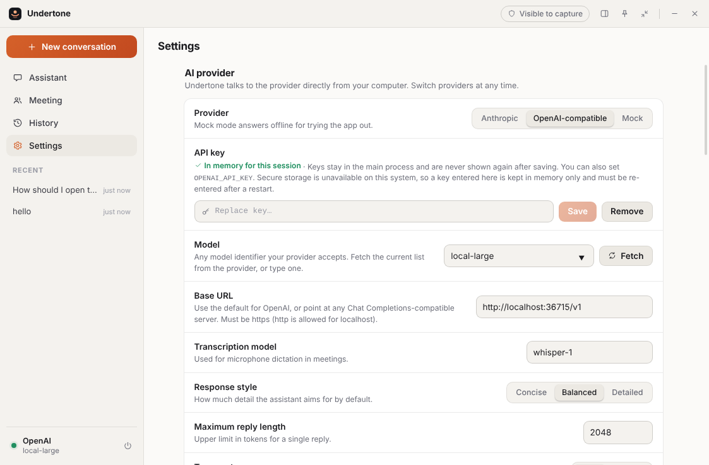

<div align="center">
  
  <h1>Undertone</h1>
  <p><strong>A quiet, floating desktop AI assistant for meetings, interviews, presentations and deep work.</strong></p>
  <p>Electron · React · TypeScript · local-first · MIT</p>
  <p><a href="https://github.com/kirtanbhatt10/undertone-desktop/actions/workflows/ci.yml"></a></p>
  <p>
    <a href="#quick-start">Quick start</a> ·
    <a href="#features">Features</a> ·
    <a href="docs/PRIVACY_MODE.md">Privacy Mode</a> ·
    <a href="docs/ARCHITECTURE.md">Architecture</a> ·
    <a href="#roadmap">Roadmap</a>
  </p>
</div>



Undertone sits beside whatever you are working in. Give it context — the meeting topic, the role you
are interviewing for, your notes, a document — and every answer is shaped by it. Call it up with a
global shortcut, capture a region of your screen to ask about it, run a meeting session that turns a
running transcript into summaries, decisions and action items, and switch on **Privacy Mode** so the
assistant window stays out of your screen share.

> **Status: 0.1.0, early.** The full test suite — including the Privacy Mode capture test — runs on
> Windows and Linux in CI on every push. It has not yet been used day-to-day on a physical Windows
> machine. See [Verification status](#verification-status) for exactly what has and has not been checked.

## Contents

- [Features](#features) · [Screenshots](#screenshots) · [Quick start](#quick-start) · [Configuration](#configuration)
- [Keyboard shortcuts](#keyboard-shortcuts) · [Privacy Mode](#privacy-mode) · [Architecture](#architecture)
- [Building and packaging](#building-and-packaging) · [Testing](#testing) · [Verification status](#verification-status)
- [Security notes](#security-notes) · [Known limitations](#known-limitations) · [Roadmap](#roadmap) · [License](#license)

## Features

**Assistant**
- Streaming chat with Markdown, tables, task lists and syntax-highlighted code
- Stop, regenerate, copy reply, copy code block, new / clear conversation
- Ten one-click quick actions: Summarize, Explain, Rewrite professionally, Generate answer, Brainstorm,
  Extract action items, Translate, Make concise, Expand, Generate follow-up. They act on your draft,
  or on the last reply, or on your context documents.
- Image input: attach, paste or drop an image, or capture a region of the screen

**Context panel**
- Topic, role, expected questions, notes, documents/text (paste or load a text file) and custom instructions
- Sent with every request while enabled; one switch pauses it

**Meeting mode**
- Start / stop a timed session, from the app or a global shortcut
- Time-stamped transcript you type or paste, with speaker labels; free-form notes
- One click each for summary, action items, decisions, follow-up points and questions to ask
- "Ask about this meeting" for short answers grounded in the transcript
- Optional microphone dictation, always behind an explicit consent prompt (OpenAI-compatible providers)

**Desktop**
- Full layout with sidebar, assistant and context panel; **compact floating mode** that stays on top
- Configurable global shortcuts, tray icon, dark / light / system theme
- **Privacy Mode**: excludes the window from supported screen capture, with an in-app self-test
- Local history of conversations and meeting sessions with search, per-item delete and clear-all
- API keys encrypted with the OS secure store; offline **Mock mode** when no key is configured

## Screenshots

| Meeting mode | Compact floating mode |
| --- | --- |
|  |  |

| Privacy Mode settings | Light theme |
| --- | --- |
|  |  |

<sub>Screenshots are generated by the test suite on Linux against a local stand-in model server, which is
why Privacy Mode shows as "unsupported" there. Regenerate them with `UNDERTONE_SHOTS=docs/screenshots npm run screenshots`.</sub>

## Quick start

Requirements: **Node.js 22+** and npm. Windows 10 (2004 or later) / Windows 11 recommended.

```bash
git clone https://github.com/kirtanbhatt10/undertone-desktop.git
cd undertone-desktop
npm install
npm start
```

With no API key the app opens in **Mock mode**: everything works and replies are simulated locally.
To get real answers, open **Settings → AI provider**, choose a provider and paste a key.

## Configuration

Keys can be supplied in two ways:

1. **In the app (recommended).** Settings → AI provider. The key is sent once to the main process,
   encrypted with the operating system's secure storage (DPAPI on Windows, Keychain on macOS,
   libsecret on Linux) and never shown again. If secure storage is unavailable the key is kept in
   memory for the session only and nothing is written to disk.
2. **Environment variables**, for development. Copy `.env.example` to `.env` (git-ignored).

| Variable | Purpose |
| --- | --- |
| `ANTHROPIC_API_KEY` | Key for the Anthropic provider |
| `OPENAI_API_KEY` | Key for OpenAI or an OpenAI-compatible server |
| `OPENAI_BASE_URL` | Optional endpoint (`https://…`, or `http://localhost…` for Ollama / LM Studio) |
| `UNDERTONE_MOCK=1` | Force the offline mock provider |
| `UNDERTONE_USER_DATA` | Absolute path for app data (history, settings, logs) |
| `UNDERTONE_DEBUG=1` | Verbose main-process logging |

`.env` is read only when running from source, never by the packaged app. Model names are free text
(with a **Fetch** button that asks the provider for its current list), so new models work without
an app update.

## Keyboard shortcuts

Global shortcuts work while another application has focus. All are configurable in
**Settings → Keyboard shortcuts**; the app tells you when a combination is already taken.

| Action | Default (Windows / Linux) | macOS |
| --- | --- | --- |
| Open / close assistant | `Ctrl` + `Alt` + `U` | `⌘ ⌥ U` |
| Toggle Privacy Mode | `Ctrl` + `Alt` + `P` | `⌘ ⌥ P` |
| Ask assistant (focus prompt) | `Ctrl` + `Alt` + `A` | `⌘ ⌥ A` |
| Capture a screen region | `Ctrl` + `Alt` + `S` | `⌘ ⌥ S` |
| Start / stop meeting | `Ctrl` + `Alt` + `M` | `⌘ ⌥ M` |
| Toggle compact mode | `Ctrl` + `Alt` + `K` | `⌘ ⌥ K` |

In the window: `Enter` send · `Shift+Enter` new line · `Ctrl+N` new conversation · `Ctrl+.` toggle context panel.
In the capture overlay: drag to select · `Enter` whole screen · `Esc` cancel.

## Privacy Mode

> Privacy Mode protects this window from supported screen-capture APIs. It cannot guarantee
> invisibility from cameras, external capture devices, or unsupported capture mechanisms.

Privacy Mode is for a simple, legitimate need: when you share your screen, your own notes and
assistant should not be broadcast with it. It uses the operating system's documented
window-protection API and nothing else.

| Platform | Mechanism | Result |
| --- | --- | --- |
| Windows 10 2004+ / Windows 11 | `SetWindowDisplayAffinity(WDA_EXCLUDEFROMCAPTURE)` | Window is omitted from captures |
| Older Windows 10 / 8 | `SetWindowDisplayAffinity(WDA_MONITOR)` | Window appears as a black rectangle |
| macOS | `NSWindow.sharingType = .none` | Partial — not honoured by ScreenCaptureKit on recent macOS |
| Linux | none available | Not supported; the app says so |

The title bar always shows the current state (`Visible to capture` / `Privacy on` / `Privacy · partial`
/ `Privacy · unsupported`) and the window gains a thin green outline while it is on.
**Settings → Privacy Mode → Run capture self-test** checks the behaviour on your own machine by
taking one screenshot through the OS capture API and looking for the window in it.

Full details — protected and unprotected capture methods, OS limitations, and how to validate it
yourself — are in **[docs/PRIVACY_MODE.md](docs/PRIVACY_MODE.md)**.

### What Privacy Mode is not

It does not hide the process, the taskbar/tray entry or network traffic, and it does not try to
evade security, monitoring or proctoring software. Undertone is not designed for, and should not be
used for, getting undisclosed help where that is against the rules — an exam, a proctored
assessment, or an interview whose terms prohibit assistance. Recording or transcribing other people
may need their consent; the app asks you to confirm that before the microphone is used.

## Architecture

```
┌──────────────────────────── main process (Node) ────────────────────────────┐
│ index.ts      lifecycle, validated IPC handlers, hardening                   │
│ ai/           ChatProvider interface → anthropic · openai-compatible · mock  │
│ store/        settings · secrets (safeStorage) · conversations · meetings    │
│ privacy.ts    setContentProtection + affinity read-back + capture self-test  │
│ capture.ts    one-shot region capture      shortcuts.ts  global hotkeys      │
└───────────────▲──────────────────────────────────────────────▲──────────────┘
                │ contextBridge: fixed, typed API (no generic invoke)           │
┌───────────────┴──────────── preload ─────────────────────────┴──────────────┐
└───────────────▲──────────────────────────────────────────────────────────────┘
┌───────────────┴──────── renderer (sandboxed, no Node) ──────────────────────┐
│ React 19 + TypeScript · store.ts · views: Assistant · Meeting · History ·    │
│ Settings · components: TitleBar · Sidebar · ContextPanel · Markdown          │
└──────────────────────────────────────────────────────────────────────────────┘
```

- **API keys and all network calls live in the main process.** The renderer has `connect-src 'none'`.
- **Providers are pluggable**: implement `ChatProvider` (`stream`, optional `listModels` / `transcribe`)
  and register it in `src/main/ai/index.ts`.
- **Every IPC call is validated** with zod schemas and checked against the calling frame.

More in [docs/ARCHITECTURE.md](docs/ARCHITECTURE.md).

**Tech stack:** Electron 40 · React 19 · TypeScript · esbuild · zod · marked + DOMPurify + highlight.js ·
Node test runner + Playwright for tests. No native modules.

## Building and packaging

```bash
npm run build          # bundle main, preload and renderer into out/
npm run dev            # rebuild on change and launch (Ctrl+R reloads the window)
npm run package        # portable build for this OS → release/
npm run package:win    # Windows x64 portable build (can be cross-built from Linux/macOS)
npm run package:linux  # Linux x64 portable build
```

Packaging produces an unpacked folder and a `.zip` in `release/` (for example
`Undertone-0.1.0-win32-x64.zip`; unzip and run `Undertone.exe`). When cross-building, the matching
Electron release is downloaded from GitHub and verified against its published SHA-256 checksums.
There is no installer or code signing yet — see the roadmap. Details in
[docs/DEVELOPMENT.md](docs/DEVELOPMENT.md).

## Testing

```bash
npm test               # unit tests (providers, SSE, prompts, storage, validation, privacy logic)
npm run test:e2e       # launches the real app with Playwright and drives every feature
npm run test:privacy   # Privacy Mode validation on the machine you run it on
npm run typecheck
npm run scan:secrets
```

On Linux without a display, prefix the e2e commands with `xvfb-run -a`.

## Verification status

Being precise about what was actually checked for 0.1.0. "CI" means the automated suite driving the
real app on GitHub-hosted runners: `windows-latest` (Windows build 10.0.26100) and `ubuntu-latest`.

| Area | Windows (CI) | Linux (CI + local) |
| --- | --- | --- |
| Clean `npm install`, typecheck, unit tests | ✅ | ✅ |
| App starts, UI loads, no crash without API config | ✅ | ✅ |
| Chat, streaming, stop, regenerate, copy, Markdown/code | ✅ | ✅ |
| Context passed to the model (asserted on the outgoing request) | ✅ | ✅ |
| OpenAI-compatible provider over real HTTP + SSE (local server) | ✅ | ✅ |
| Meeting mode, history, settings, persistence, reset | ✅ | ✅ |
| Region capture and image attach | ✅ | ✅ |
| Microphone dictation flow (fake audio device, mock transcriber) | ✅ | ✅ |
| Global shortcuts | ✅ registration, rebinding, conflicts — key presses not injected | ✅ including real key presses at the X server |
| Privacy Mode toggle, indicator, persistence | ✅ | ✅ |
| **Privacy Mode excludes the window from an OS screen capture** | ✅ OS reports the window as protected and it is absent from the capture; the control case (off ⇒ captured) passes | n/a — unsupported, and the app reports "exposed" |
| Production build | ✅ | ✅ |
| Portable package | built (cross-packaged from Linux), **not launched** | ✅ built and launched |

Not verified:

- **A physical Windows desktop.** The Windows results come from a CI virtual machine. Nobody has yet
  used the app by hand on Windows, so visual polish, the tray, DPI scaling and multi-monitor
  behaviour are unchecked there.
- **Specific capture tools.** The Privacy Mode test captures through Electron's `desktopCapturer`
  (the Windows Graphics Capture / DXGI path). Teams, Zoom, Meet, OBS, Snipping Tool and the GDI
  path were not individually tested — try yours before relying on it.
- **Anthropic provider against the live API** (unit-tested against the documented stream format
  only), and live transcription against a real endpoint.
- **macOS** — untested, and not packaged.
- `scripts/privacy-check.ps1` has not been executed.
- There is **no `package-lock.json`** yet (the project was bootstrapped without registry access);
  run `npm install` and commit the lockfile. `npm audit` runs in CI but its result is advisory.

## Security notes

- Renderer is sandboxed with context isolation, no Node integration, a strict CSP and no network access
- Navigation, new windows and `<webview>` are blocked; external links open only as `https:` / `mailto:`
- Model output is sanitised with DOMPurify before rendering; remote images are never loaded
- API keys never reach the renderer, the logs, or disk in plaintext
- Logs contain metadata only (no prompts, replies or transcripts) and are passed through a redactor
- History is stored as plain JSON in your user profile — protect it with disk encryption if needed

See [SECURITY.md](SECURITY.md) for the review checklist and how to report a vulnerability.

## Known limitations

- Verified on Windows in CI only, not yet on a physical Windows desktop; macOS is untested and not packaged (see above).
- Privacy Mode cannot protect against cameras, capture cards, remote-desktop tools, virtual machine
  hosts, or software that does not go through the OS compositor's capture path; on Linux it is unavailable.
- Live transcription is microphone-only (your side of the conversation) in ~20-second clips, and needs an
  OpenAI-compatible transcription endpoint. System/loopback audio is not captured.
- Documents are plain text; PDF and Word files must be pasted as text.
- Portable builds only: no installer, auto-update or code signing, and the Windows `.exe` keeps the
  stock Electron file icon (the window and taskbar icon are Undertone's).
- "Launch at login" applies only to packaged builds on Windows and macOS.
- Conversations are sent in full each turn; very long chats can exceed a model's context window.

## Roadmap

- [ ] Hands-on Windows release testing (DPI, tray, multi-monitor, real meeting apps); commit `package-lock.json`
- [ ] Signed installer (NSIS / MSIX), auto-update, branded executable icon, Electron fuses
- [ ] macOS build with a ScreenCaptureKit-aware privacy story
- [ ] PDF / DOCX import into context
- [ ] Optional local transcription (Whisper) and system-audio capture with clear consent UX
- [ ] More providers (Gemini, Azure OpenAI), per-conversation model choice
- [ ] Conversation search across message bodies; export to Markdown
- [ ] Encrypted-at-rest history

## Contributing

See [CONTRIBUTING.md](CONTRIBUTING.md). Bug reports and focused pull requests are welcome.

## License

[MIT](LICENSE). Undertone is an independent, original project; it is not affiliated with, derived
from, or endorsed by any other assistant product.
