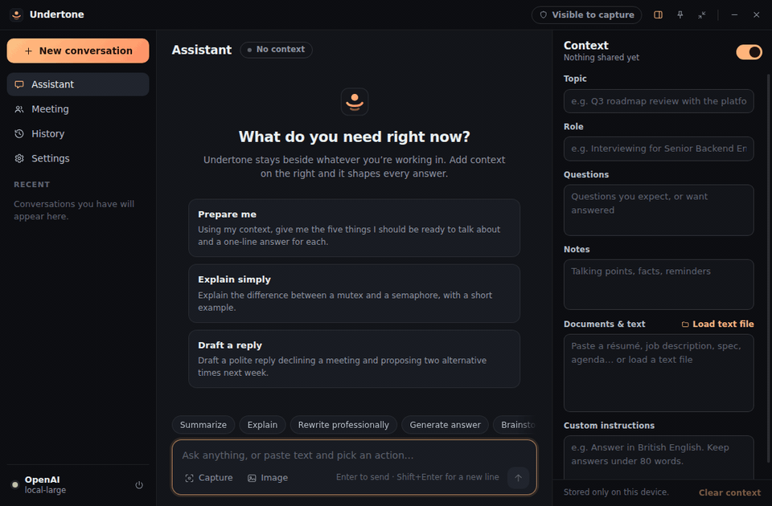
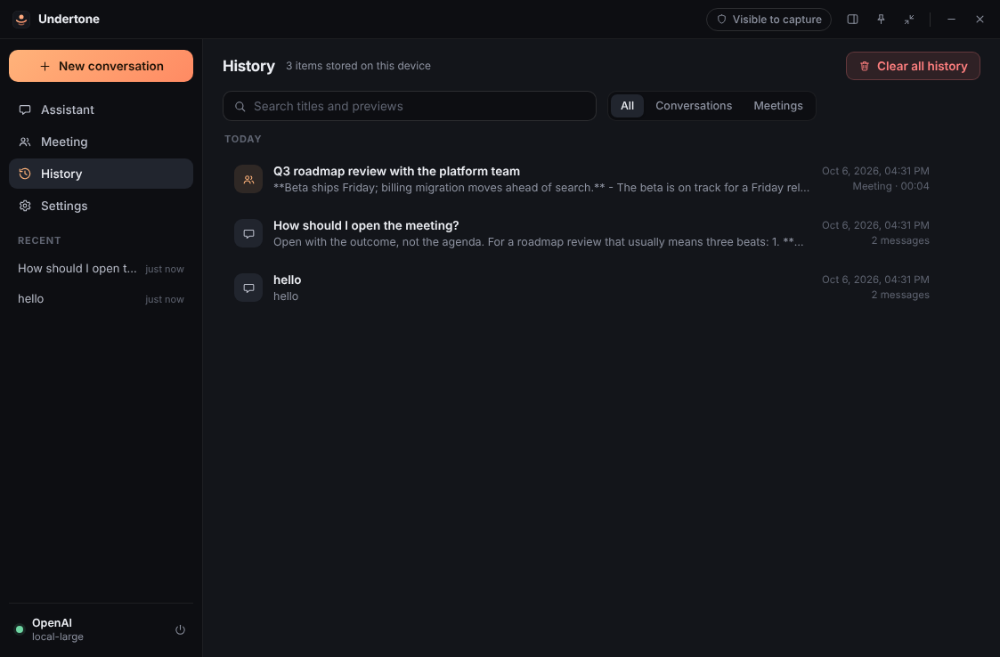

<div align="center">
  
  <h1>Undertone</h1>
  <p><strong>A quiet, floating desktop AI assistant that stays beside your work and out of your screen share.</strong></p>
  <p>
    <a href="https://github.com/kirtanbhatt10/undertone-desktop/actions/workflows/ci.yml"></a>
    
    
    <a href="LICENSE"></a>
  </p>
  <p>
    <a href="#download">Download</a> ·
    <a href="#features">Features</a> ·
    <a href="#screenshots">Screenshots</a> ·
    <a href="#run-from-source">Run from source</a> ·
    <a href="#privacy-mode">Privacy Mode</a> ·
    <a href="#tech-stack">Tech stack</a> ·
    <a href="#roadmap">Roadmap</a>
  </p>
</div>



Undertone is an Electron app for meetings, interviews, presentations and deep work. You give it
context once (the meeting topic, the role, your notes, a document) and every answer is shaped by it.
Call it up with a global shortcut, capture a region of your screen to ask about it, turn a running
transcript into summaries and action items, and switch on **Privacy Mode** so the assistant window
is left out of your screen share.

It works with Anthropic, OpenAI and any OpenAI-compatible server (Ollama, LM Studio), and runs fully
offline in **Mock mode** when no key is set.

> **Status: 0.1.0, early.** The full test suite, including the Privacy Mode capture test, runs on
> Windows and Linux in CI on every push. It has not yet been used day to day on a physical Windows
> machine, and macOS is untested. Exactly what was and was not checked is in
> [docs/VERIFICATION.md](docs/VERIFICATION.md).

## Download

Get the latest build from the [Releases page](https://github.com/kirtanbhatt10/undertone-desktop/releases/latest).

| Platform | File | Notes |
| --- | --- | --- |
| Windows 10 / 11 (x64) | `Undertone-Setup-<version>-x64.exe` | Installs for the current user, no administrator rights needed. Adds Start menu and desktop shortcuts and an uninstaller. |
| Windows, no install | `Undertone-<version>-win32-x64.zip` | Unzip anywhere and run `Undertone.exe`. |
| Debian / Ubuntu (x64) | `undertone_<version>_amd64.deb` | `sudo apt install ./undertone_<version>_amd64.deb`, then start **Undertone** from the launcher or run `undertone`. |
| Linux, no install | `Undertone-<version>-linux-x64.zip` | Unzip and run `./undertone`. |

The builds are **not code-signed** yet. Windows SmartScreen will warn about an unrecognised app the
first time; choose **More info → Run anyway** if you trust the download, and check it against
`SHA256SUMS.txt` from the same release first. The app opens in **Mock mode** with simulated replies
until you add an API key in **Settings → AI provider**.

## Features

| | |
| --- | --- |
| **Context-aware chat** | Streaming replies with Markdown, tables and highlighted code. Topic, role, expected questions, notes and documents are sent with every request, with one switch to pause them. |
| **Quick actions** | Ten one-click actions (Summarize, Explain, Rewrite professionally, Translate, Extract action items and more) that act on your draft, the last reply or your context documents. |
| **Screen and image input** | Capture a region of the screen with a shortcut, or attach, paste or drop an image. |
| **Meeting mode** | A timed session with a time-stamped transcript and notes. One click each for summary, decisions, action items, follow-ups and questions to ask, plus "Ask about this meeting". Optional microphone dictation behind an explicit consent prompt. |
| **Privacy Mode** | Excludes the window from supported screen capture, shows the real state in the title bar, and includes a self-test you can run on your own machine. |
| **Compact floating mode** | A small always-on-top window, with configurable global shortcuts, a tray icon and dark, light or system theme. |
| **Local-first** | History stays on your machine with search and delete. API keys are encrypted with the OS secure store and never reach the renderer. |

## Screenshots


| Meeting mode | Compact floating mode |
| --- | --- |
|  |  |

| Privacy Mode settings | History |
| --- | --- |
|  |  |

<details>
<summary>Light theme</summary>


</details>

<sub>The demo GIF and the screenshots are recorded from the real app on Linux against a local stand-in
model server, which is why Privacy Mode shows as "unsupported" there. Regenerate them with
`npm run demo` and `UNDERTONE_SHOTS=docs/screenshots npm run screenshots`.</sub>

## Run from source

**Requirements:** Node.js 22 or later and npm. Windows 10 (version 2004 or later) or Windows 11 is
recommended; Linux works without Privacy Mode.

```bash
git clone https://github.com/kirtanbhatt10/undertone-desktop.git
cd undertone-desktop
npm install
npm start
```

The app opens in **Mock mode** with simulated replies, so you can try everything without a key.

**To get real answers:** open **Settings → AI provider**, choose a provider and paste your key. It is
encrypted with the operating system's secure storage (DPAPI, Keychain or libsecret) and never shown
again. Model names are free text, with a **Fetch** button that asks the provider for its current
list.

<details>
<summary>Environment variables (for development)</summary>

Copy `.env.example` to `.env` (git-ignored). `.env` is read only when running from source, never by
the packaged app.

| Variable | Purpose |
| --- | --- |
| `ANTHROPIC_API_KEY` | Key for the Anthropic provider |
| `OPENAI_API_KEY` | Key for OpenAI or an OpenAI-compatible server |
| `OPENAI_BASE_URL` | Optional endpoint (`https://…`, or `http://localhost…` for Ollama / LM Studio) |
| `UNDERTONE_MOCK=1` | Force the offline mock provider |
| `UNDERTONE_USER_DATA` | Absolute path for app data (history, settings, logs) |
| `UNDERTONE_DEBUG=1` | Verbose main-process logging |

</details>

## Keyboard shortcuts

Global shortcuts work while another application has focus. All of them can be changed in
**Settings → Keyboard shortcuts**.

| Action | Windows / Linux | macOS |
| --- | --- | --- |
| Open / close assistant | `Ctrl` + `Alt` + `U` | `⌘ ⌥ U` |
| Toggle Privacy Mode | `Ctrl` + `Alt` + `P` | `⌘ ⌥ P` |
| Ask assistant (focus prompt) | `Ctrl` + `Alt` + `A` | `⌘ ⌥ A` |
| Capture a screen region | `Ctrl` + `Alt` + `S` | `⌘ ⌥ S` |
| Start / stop meeting | `Ctrl` + `Alt` + `M` | `⌘ ⌥ M` |
| Toggle compact mode | `Ctrl` + `Alt` + `K` | `⌘ ⌥ K` |

In the window: `Enter` send · `Shift+Enter` new line · `Ctrl+N` new conversation · `Ctrl+.` toggle
context panel.

## Privacy Mode

> Privacy Mode protects this window from supported screen-capture APIs. It cannot guarantee
> invisibility from cameras, external capture devices, or unsupported capture mechanisms.

When you share your screen, your own notes and assistant should not be broadcast with it. Privacy
Mode uses the operating system's documented window-protection API and nothing else.

| Platform | Mechanism | Result |
| --- | --- | --- |
| Windows 10 2004+ / Windows 11 | `SetWindowDisplayAffinity(WDA_EXCLUDEFROMCAPTURE)` | Window is omitted from captures |
| Older Windows 10 / 8 | `SetWindowDisplayAffinity(WDA_MONITOR)` | Window appears as a black rectangle |
| macOS | `NSWindow.sharingType = .none` | Partial: not honoured by ScreenCaptureKit on recent macOS |
| Linux | none available | Not supported, and the app says so |

The title bar always shows the true state, and **Settings → Privacy Mode → Run capture self-test**
checks the behaviour on your own machine. Full details are in
[docs/PRIVACY_MODE.md](docs/PRIVACY_MODE.md).

**What it is not.** Privacy Mode does not hide the process, the taskbar or tray entry, or network
traffic, and it does not try to evade security, monitoring or proctoring software. Undertone is not
designed for, and should not be used for, getting undisclosed help where that is against the rules:
an exam, a proctored assessment, or an interview whose terms prohibit assistance. Recording or
transcribing other people may need their consent, and the app asks you to confirm that before the
microphone is used.

## Tech stack

| Layer | Used |
| --- | --- |
| Shell | Electron 40, no native modules |
| UI | React 19, TypeScript |
| Build | esbuild |
| Validation | zod on every IPC call |
| Rendering model output | marked, DOMPurify, highlight.js |
| Tests | Node test runner (unit), Playwright (end to end) |
| CI | GitHub Actions on `windows-latest` and `ubuntu-latest` |

## How it is built

- **Three processes, strict boundaries.** The main process owns API keys, storage and every network
  call. The renderer is sandboxed with no Node integration, a strict CSP and `connect-src 'none'`.
  The preload exposes a fixed, typed API and no generic `invoke`.
- **Pluggable providers.** Implement `ChatProvider` (`stream`, optional `listModels` and
  `transcribe`) and register it in `src/main/ai/index.ts`. Anthropic, OpenAI-compatible and mock
  providers ship today.
- **Safe by default.** Model output is sanitised before rendering, remote images are never loaded,
  navigation and new windows are blocked, and logs carry metadata only.

More in [docs/ARCHITECTURE.md](docs/ARCHITECTURE.md) and [SECURITY.md](SECURITY.md).

## Develop, test and package

```bash
npm run dev            # rebuild on change and launch
npm test               # unit tests
npm run test:e2e       # launches the real app with Playwright and drives every feature
npm run test:privacy   # Privacy Mode validation on the machine you run it on
npm run typecheck
npm run scan:secrets
npm run package        # portable build for this OS, written to release/
npm run package:win    # Windows x64 portable build (can be cross-built from Linux or macOS)
npm run installer:win  # Windows setup program from that build (needs NSIS)
npm run installer:linux  # .deb from the Linux build
npm run demo           # re-record docs/demo.gif (needs ffmpeg)
```

On Linux without a display, prefix the end-to-end commands with `xvfb-run -a`. Releases are built,
installed and started on clean Windows and Linux runners by the
[Release workflow](.github/workflows/release.yml) before anything is published. There is no code
signing or auto-update yet. Details in [docs/DEVELOPMENT.md](docs/DEVELOPMENT.md).

## Limitations

- Verified on Windows in CI only, not yet on a physical Windows desktop. macOS is untested.
- Privacy Mode cannot protect against cameras, capture cards, remote-desktop tools or virtual
  machine hosts, and is unavailable on Linux.
- Dictation is microphone-only and needs an OpenAI-compatible transcription endpoint.
- Context documents are plain text; PDF and Word files must be pasted as text.

The full list and the feature-by-feature verification table are in
[docs/VERIFICATION.md](docs/VERIFICATION.md).

## Roadmap

- [ ] Hands-on Windows release testing (DPI, tray, multi-monitor, real meeting apps)
- [x] Windows installer and `.deb` package, built and smoke-tested in CI
- [ ] Code signing, auto-update and a branded executable icon
- [ ] macOS build with a ScreenCaptureKit-aware privacy story
- [ ] PDF and DOCX import into context
- [ ] Optional local transcription (Whisper) and system-audio capture with clear consent UX
- [ ] More providers (Gemini, Azure OpenAI) and per-conversation model choice
- [ ] Conversation search across message bodies, export to Markdown
- [ ] Encrypted-at-rest history

## Contributing

See [CONTRIBUTING.md](CONTRIBUTING.md). Bug reports and focused pull requests are welcome.

## Licence

[MIT](LICENSE). Undertone is an independent, original project; it is not affiliated with, derived
from, or endorsed by any other assistant product.
